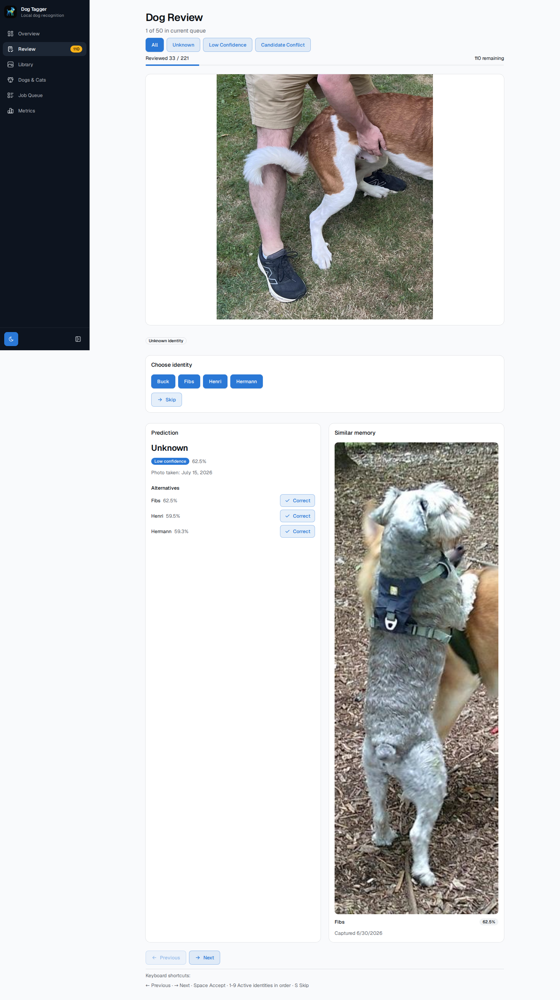

# Immich Dog Tagger

AI-assisted dog detection and identity classification pipeline for [Immich](https://immich.app/).


Immich Dog Tagger scans an Immich photo library, detects dogs, creates crops, generates image embeddings, and classifies individual dogs using a locally learned identity model.

The system is designed around human-in-the-loop learning:

1. Detect dogs
2. Generate identity predictions
3. Review uncertain results
4. Correct mistakes
5. Learn from confirmed examples
6. Improve future classifications

The goal is to identify individual dogs such as:

* Hermann
* Fibonacci (Fibs)
* Henri

while keeping all processing local.

---

# Quick Start

For a fresh machine, bootstrap both Python and UI dependencies:

```bash
./scripts/bootstrap.sh
```

Install dependencies:

```bash
uv sync
```

Run the processing pipeline:

```bash
immich-dog-tagger scan
immich-dog-tagger download
immich-dog-tagger detect
immich-dog-tagger classify
```

Start the backend API:

```bash
uv run uvicorn immich_dog_tagger.api.app:app --reload
```

Start the frontend:

```bash
cd ui
npm install
npm run dev
```

Open:

```
http://localhost:5173
```

Review images and correct predictions. When you've reviewed a batch, click
**Reclassify** in Overview to apply what you've learned to the rest of
the library, then repeat. For the full first-project walkthrough (how much to
review, when to reclassify, what confidence/needs-review/unknown mean, backups,
and known limitations), see:

[New Project Workflow](docs/workflow.md)

Publish results back to Immich:

```bash
immich-dog-tagger sync
```

For a production-style deployment with Docker and Traefik, see:

[Deployment Guide](docs/deployment.md)

---

# Project Status

Current release:

```
v1.4.0
```

Release v1.4.0 shifts the primary mental model from "process a review queue" to "maintain a
trustworthy, searchable library of tagged photos," described in
[docs/specs/v1.4-trustworthy-photo-library.md](docs/specs/v1.4-trustworthy-photo-library.md):

* Each photo's own capture date shown next to its prediction everywhere a classification is
  shown -- the Review page and the review export text -- with an explicit "date unknown" state
* A new Library page and sidebar tab: every classified photo, reviewed and unreviewed alike,
  filterable by identity, species, reviewed status, and capture-date range, with the same
  identity-correction control the Review page has
* Corrections work identically from the library as from Review, on already-reviewed items too --
  and re-running sync now actually removes a corrected asset from its previous identity's Immich
  album instead of leaving it in both
* An optional owner-set active date range per identity (Dogs & Cats page): a candidate match whose
  photo falls outside it is flagged as a `date-conflict`, never silently accepted -- and never
  penalized when date evidence is missing on either side

Release v1.3.0 extends detection, classification, review, and sync to cats alongside dogs,
described in [docs/tickets/DT-1110-cat-support.md](docs/tickets/DT-1110-cat-support.md):

* Species-scoped identities and crops, via a backward-compatible additive migration for existing
  dog-only projects
* Species-scoped nearest-neighbor classification -- a dog photo is never matched against a cat
  identity or vice versa
* One unified review queue and correction UI for both species, with a per-item species-scoped
  identity chooser -- no separate tab, page, or mode for cats
* Species-aware Immich album naming, and a per-species breakdown on the Learning Progress metric

Release v1.2.0 delivers one consistent visual identity across the app, described in
[docs/specs/v1.2-visual-style-refresh.md](docs/specs/v1.2-visual-style-refresh.md):

* A sidebar navigation shell, replacing the horizontal pill nav
* A single blue action-color accent and a validated status/categorical color palette, applied
  consistently across Mission Control, Metrics, Job Queue, and Review
* A reusable stat-tile primitive and new donut/trend charts on the Metrics tab, including one
  consolidated dual-axis Progress Over Time chart
* Dog management moved to its own `/dogs` page and sidebar tab
* UX follow-ups: destructive-button contrast fix, relative "last updated" time, a Mission Control
  next-action banner, and an automation-rate trend delta on Metrics

Release v1.1.0 delivers the Automation Coverage Dashboard described in
[docs/specs/v1.1-automation-coverage-dashboard.md](docs/specs/v1.1-automation-coverage-dashboard.md):

* A dedicated Metrics tab, separate from Mission Control
* Per-classification-pass snapshots of labeled-example count and review-queue size, so coverage
  trends are visible across passes rather than only as a single current number
* A reconciled review-queue metric definition and a single, prominent automation-rate number
  answering "how much of this am I no longer doing by hand?"

Release v1.0.0 delivers the full review-driven learning loop described in
[docs/specs/v1.0.0.md](docs/specs/v1.0.0.md) and
[docs/workflow.md](docs/workflow.md):

* A `Reclassify` operation that recomputes predictions from your reviewed
  examples without rescanning, redownloading, or redetecting, and without
  ever touching a label you've already confirmed
* A single centralized classifier policy (confidence threshold, candidate
  ranking, confident/needs-review/unknown decision) used consistently by
  the pipeline, Reclassify, and the review queue
* A "Learning Progress" dashboard on the Metrics tab: confident coverage,
  review rate, labeled-example count, last-Reclassify status, and a
  coverage trend across recent passes
* A fixed review-to-example leakage defect, so re-reviewing a crop under a
  different identity (or correcting it to Unknown) no longer leaves a
  stale reference example behind
* Reclassify inherits the existing job system's queued/running/completed/
  failed states, single-flight locking, and startup recovery, extended to
  also reconcile an interrupted classification pass on restart
* Structured lifecycle logging for the pipeline, corrections, and
  Reclassify, verified to never include image paths or content
* Two fixed N+1 database-query defects and a batched, bounded-memory
  Reclassify implementation
* An end-to-end regression suite covering the full review -> reclassify
  user journey, including failure/retry and existing-project migration

Release v0.8.0 expands classification context and makes the review loop more explicit:

* Ranked identity candidates for each prediction
* Temporal metadata attached to matched examples
* Candidate-aware classification and review support
* Review queue reasons exposed through the API and UI
* Candidate-conflict review filtering
* Explicit correction actions in the review workspace
* Unified bootstrap and validation scripts for local development

The project now includes a richer human review and active-learning workflow:

* FastAPI service layer
* Browser-based review interface
* Dockerized frontend deployment
* Traefik HTTPS exposure
* Human correction workflow integration
* Immediate learning from corrections
* Review audit history
* Ranked correction candidates
* Review reason labeling
* Similar-example capture dates

Completed:

* End-to-end dog detection, embedding, and identity classification pipeline
* Ranked candidate suggestions persisted with classifications
* Temporal metadata on embedding examples and review suggestions
* Browser review workspace with keyboard shortcuts and explicit correction buttons
* Review queue reasons, filtering, and candidate-conflict triage
* Immediate learning from review corrections with preserved capture metadata
* Review statistics, audit history, and skip workflow
* Dockerized FastAPI and React deployment behind Traefik
* Unified bootstrap and project-wide validation scripts
* Reclassify: safe, idempotent, ground-truth-preserving reclassification from reviewed examples
* Centralized nearest-neighbor classifier policy shared by the pipeline, Reclassify, and review queue
* Learning Progress dashboard with coverage/review-rate metrics and a pass-history trend
* Job lifecycle hardening: interrupted-job and interrupted-pass recovery on restart
* Pipeline/correction/Reclassify lifecycle logging with no image content or paths logged
* N+1 query fixes and batched processing validated for large-project scale
* Dedicated Metrics tab with per-pass labeled-example/review-queue snapshots and a prominent automation-rate metric
* One consistent visual identity: sidebar navigation shell, blue action accent, validated status/categorical palette, and a reusable stat-tile/chart pattern across all pages
* Cat support alongside dogs: species-scoped identities, crops, and classification; one unified review queue and correction UI for both species; species-aware Immich album naming
* Trustworthy Photo Library: photo capture dates throughout, a searchable/filterable Library of every classified photo, library-side corrections with correct Immich album cleanup on sync, and date-aware classification flagging via an optional owner-set active range per identity

---

# Architecture

The central design principle is:

> `state.db` is the source of truth.

Immich is treated as a photo source and presentation target. The local database owns processing state, classifications, review history, and learned examples.

Current architecture:

```
                         Browser
                            |
                            v
                         Traefik
                            |
                            v
                     React UI (nginx)
                            |
                            v
                      FastAPI API
                            |
                            v
                   Application Services
                            |
                            v
                         state.db
                            |
              +-------------+-------------+
              |                           |
              v                           v

          ML Pipeline              Immich Sync
```

The CLI remains the operational interface for pipeline execution, maintenance, and automation.

The Web API provides the human interaction layer for review and correction workflows.

---

# Features

## Machine Learning Pipeline

* Scan an Immich library through the Immich API
* Maintain persistent local processing state
* Download and cache assets
* Detect dogs using YOLO
* Generate dog crops
* Generate embeddings using OpenCLIP
* Classify dogs using embedding similarity
* Retain ranked identity candidates for each classification
* Track classification confidence
* Add temporal metadata to matched examples
* Track classification provenance:

  * automatic predictions
  * human corrections
* Explain classifications using matched examples and capture dates

Supported identities include:

* Hermann
* Fibonacci (Fibs)
* Henri

---

## Human Review Workflow



The review workflow allows the system to improve through human feedback.

Features:

* Prioritized review queue
* Unknown and low-confidence prioritization
* Candidate-conflict prioritization
* Modern browser-based review workspace
* Review workflow controls and progress visualization
* Keyboard-friendly rapid correction workflow
* Loading skeletons and empty states
* Responsive UI behavior across desktop and mobile
* Review filter buttons for all, unknown, low-confidence, and candidate-conflict queues
* Keyboard shortcuts for rapid correction:

```
f → Fibonacci
h → Hermann
n → Henri
u → Unknown
```

Each review item can display:

* Current prediction
* Similarity score
* Ranked identity candidates
* Review reason
* Supporting example path and capture date when available
* Explicit correction actions

Corrections:

* Update the classification
* Record human provenance
* Create future reference examples
* Apply candidate suggestions directly from the review UI

---

## Web API

The Web API exposes existing application services through FastAPI.

Current endpoints include:

```plain
GET  /review
GET  /review/stats
POST /review/{id}/correct
POST /review/{id}/skip
GET  /crops/{id}
GET  /embedding-examples/{id}/image
GET  /health
```

The review queue endpoint supports query filters for unknown items, low-confidence items, and candidate conflicts.

The API sits above the application layer rather than replacing the CLI or pipeline.

---

# Deployment

Immich Dog Tagger can be deployed as a pair of Docker services:

```
Browser
  |
  v
Traefik
  |
  v
dog-tagger-ui
  |
  v
dog-tagger API
```

The frontend container serves the React application and proxies `/api/*` requests to the FastAPI backend.

Production deployments use:

* Docker Compose
* nginx frontend serving
* Traefik dynamic routing
* HTTPS certificates through the existing proxy stack

The deployment documentation is available here:

[Deployment Guide](docs/deployment.md)

---

# Running Locally

The review API is served by FastAPI via Uvicorn, and the browser UI is served by Vite.

## Backend API

From the repository root:

```bash
uv sync

uv run uvicorn immich_dog_tagger.api.app:app --reload --host 0.0.0.0 --port 8000
```

The API will be available at:

```
http://localhost:8000
```

Interactive docs:

```
http://localhost:8000/docs
```

## Web UI

In a second terminal:

```bash
cd ui
npm install
npm run dev
```

The UI will be available at:

```
http://localhost:5173
```

The Vite development server proxies `/api` requests to the backend.

---

# Processing Pipeline

```
Immich
 |
 v
Scanner
 |
 v
Downloader
 |
 v
YOLO Dog Detection
 |
 v
Crop Generation
 |
 v
OpenCLIP Embeddings
 |
 v
Identity Classification
 |
 v
Human Review
 |
 v
Learning Examples
 |
 v
Improved Classification
```

Processing stages:

```
scan
Discover assets from Immich

download
Cache local copies

detect
Locate dogs and create crops

classify
Generate identity predictions

review
Inspect and correct predictions

learn
Add confirmed examples

sync
Update Immich albums
```

---

# Database

The SQLite database is the system of record.

It stores:

* discovered assets
* detections
* crops
* classifications
* identities
* embedding examples
* review corrections
* provenance metadata

Example:

```
data/breimer/

├── state/
│   └── state.db
│
└── cache/
    ├── assets/
    ├── crops/
    └── review/
```

The cache contains rebuildable artifacts.

The database contains knowledge.

---

# Learning System

The learning system uses incremental reference examples while keeping model weights fixed.

```
Confirmed Crop
 |
 v
Embedding
 |
 v
Identity Example
 |
 v
Future Classification
```

As more photos are reviewed, the local identity dataset grows.

The current system uses embedding similarity against learned examples.

---

# Immich Synchronization

After classification:

```bash
immich-dog-tagger sync
```

The sync service projects classifications into Immich albums:

```
Dog - Hermann
Dog - Fibonacci
Dog - Henri
```

Immich remains the presentation layer.

The local database remains authoritative.

---

# Requirements

* Python 3.14+
* `uv`
* SQLite
* Immich instance with API access
* NVIDIA GPU recommended for local AI inference

Tested development environment:

* Ubuntu Linux
* NVIDIA CUDA
* RTX-class GPU

CPU execution is possible but significantly slower.

---

# Development

Bootstrap a fresh environment:

```bash
./scripts/bootstrap.sh
```

Install dependencies:

```bash
uv sync
```

Run tests:

```bash
uv run pytest
```

Run validation:

```bash
./scripts/check.sh
```

UI validation:

```bash
cd ui
npm run build
npm run lint
```

Current validation:

```
Python tests: passing
UI build: passing
UI lint: passing
```

---

# Roadmap

See [docs/roadmap.md](docs/roadmap.md) for the full milestone history.

## Next

Future work focuses on improving classification quality beyond the v1.0.0 loop:

* improved reference-example selection and reference-set curation workflows
* confidence analysis
* a polished, fully web-driven operator workflow

---

# Design Goals

The project intentionally avoids:

* cloud AI services
* uploading personal photos externally
* modifying Immich internals
* retraining large neural networks

The goal is a small local assistant that gradually learns the identities of the dogs in a personal photo library.

> **The database is the brain.
> The ML pipeline is the nose.
> Immich is the gallery.
> The review UI curates the reference set in state.db.**
