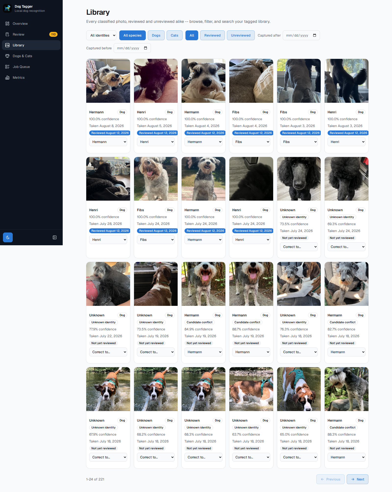
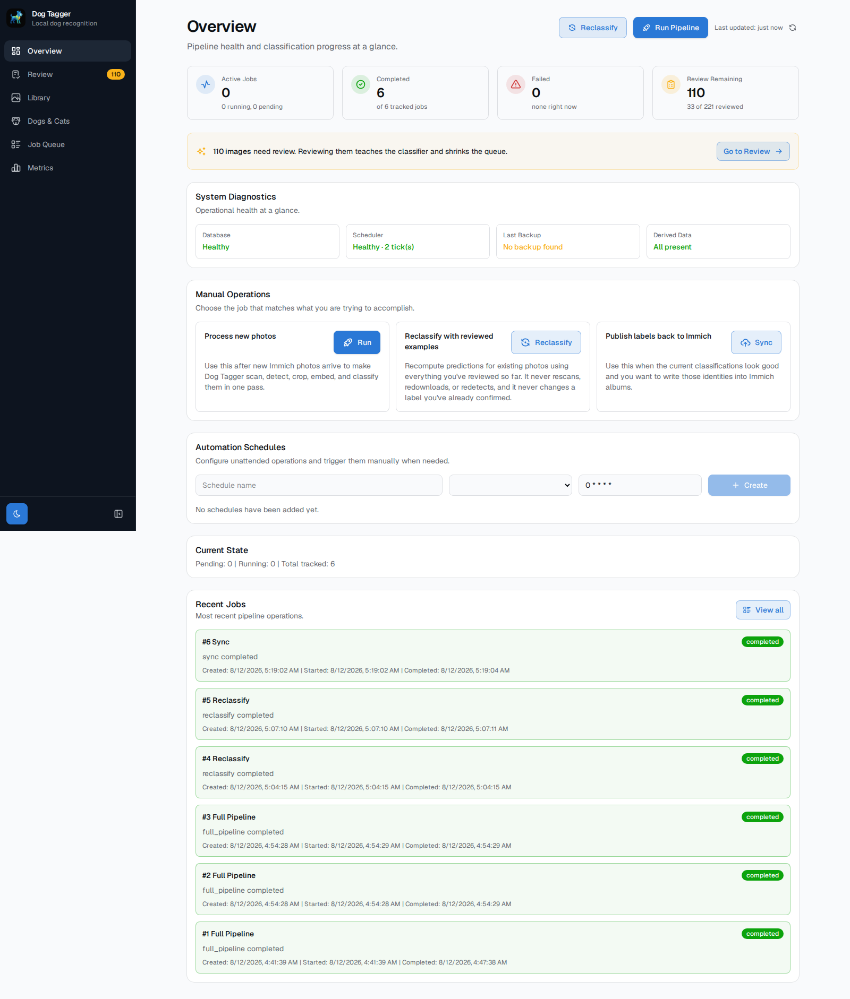
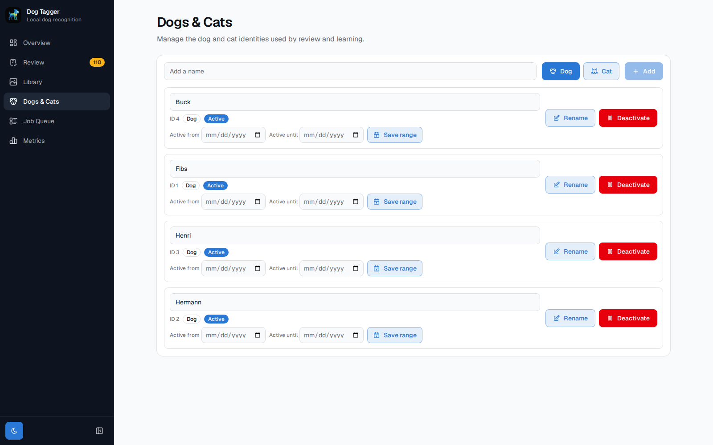

# Immich Dog Tagger

**Individual pet recognition for Immich.**

Immich can already tell you a photo contains a dog. It can't tell you it's *Hermann*. This project
adds that layer: it finds each animal in your [Immich](https://immich.app/) photo library, learns
to tell individual pets apart from corrections you make in a review UI, and syncs the results back
to Immich as albums — one per pet.

It's a sidecar, not a fork or a replacement. It runs next to your Immich instance, talks to it
only through the API, and never touches Immich's own database. Everything it learns lives in its
own local `state.db` — that file, not Immich, is the source of truth for every identity and every
review decision. No photo or image data ever leaves your machine.

Dogs and cats are supported today. The identity model isn't dog-specific — "Hermann" and "Rory"
below are just examples, you name your own pets — and the project is built toward any
individually-recognizable pet, not a fixed species list.


<!-- TODO: before/after screenshot here — Immich's own generic "dog" search result next to this
     project's Library view showing a named identity. This is the single image that makes the
     30-second pitch land; worth prioritizing over everything else in this file. -->

## How it works

```
detect → classify → review → correct → learn → sync
```

1. **Detect.** YOLO finds dogs and cats in each photo and crops them out.
2. **Classify.** An embedding of each crop is compared against the reference examples you've
   confirmed so far. If nothing matches well enough, it's left Unknown — no guessing.
3. **Review.** You confirm or correct each guess in the browser.
4. **Correct.** Wrong guesses get fixed with one click or keypress.
5. **Learn.** Every correction becomes a new reference example. Future guesses get better because
   there are more examples to compare against — no retraining, no model weights change.
6. **Sync.** Confirmed identities are published back to Immich as albums (`Dog - Hermann`,
   `Cat - Rory`, ...).

Run the loop, review a batch, hit Reclassify to re-score everything else against what you just
taught it, repeat. The more you review, the less you need to.

## The Review Dashboard

This is where you spend most of your time. It's a queue of detections that need a human
decision — unknowns, low-confidence guesses, and cases where two candidate identities are close.


- One keyboard shortcut per identity, plus `u` for Unknown — no mouse required to get through a
  queue.
- Filter by unknown / low-confidence / candidate-conflict.
- Each item shows its ranked candidate identities, similarity score, and the photo's own capture
  date, so you're not guessing why the model thinks what it thinks.
- Corrections here (and from the Library page, below) feed directly back into classification —
  there's no separate "training" step.

<!-- TODO: short GIF of a correction happening — an identity hotkey pressed, queue count and
     confidence updating live. Explains the review-driven learning loop faster than prose. -->

Beyond Review, there's a searchable **Library** of every classified photo (reviewed or not,
filterable by identity/species/date) and an **Overview** dashboard for pipeline status and
learning progress over time:

| Library | Overview | Pet identities |
|---|---|---|
|  |  |  |

The identities screen is where you define your own pets — nothing is hardcoded.

## Getting started

Requirements: Docker + [Docker Compose](https://docs.docker.com/compose/), and a running Immich
instance with an API key. GPU recommended, CPU works but is slower.

```bash
# 1. Grab the compose file and env template
curl -O https://raw.githubusercontent.com/bradreimer/immich-dog-tagger/main/docker-compose.yml
curl -O https://raw.githubusercontent.com/bradreimer/immich-dog-tagger/main/.env.example
mv .env.example .env
# edit .env: set IMMICH_URL and IMMICH_API_KEY

# 2. Pull the latest published images and start both containers
docker compose up -d

# 3. Run the pipeline once
docker compose exec dog-tagger immich-dog-tagger init-db
docker compose exec dog-tagger immich-dog-tagger scan
docker compose exec dog-tagger immich-dog-tagger download
docker compose exec dog-tagger immich-dog-tagger detect
docker compose exec dog-tagger immich-dog-tagger classify
```

Expect almost everything to come back Unknown the first time — there are no reference examples
yet. That's expected, not a bug.

Open `http://localhost:8080`, review a batch (50–100 is a reasonable start), click **Reclassify**
in Overview, repeat until the queue is mostly empty. Then publish what you're confident in:

```bash
docker compose exec dog-tagger immich-dog-tagger sync
```

Images are published to `ghcr.io/bradreimer/immich-dog-tagger` on every push to `main`, tagged
`latest`. If `docker compose pull` fails with `unauthorized`, the package is set to private —
either make it public in the repo's GitHub Packages settings, or run
`docker login ghcr.io` first with a token that has `read:packages`.

Full walkthrough — how much to review first, what "confident" vs "needs review" means, backing up
`state.db` — in [docs/workflow.md](docs/workflow.md). A production setup behind Traefik with TLS
and GPU scheduling — `docker-compose.yml` plus a `docker-compose.prod.yml` overlay — is in
[docs/deployment.md](docs/deployment.md).

### Running from source (development)

Requirements: Python 3.14+, [`uv`](https://docs.astral.sh/uv/), Node.js/npm.

```bash
# 1. Install dependencies
./scripts/bootstrap.sh

# 2. Point it at your Immich instance
cp .env.example .env
# edit .env: set IMMICH_URL and IMMICH_API_KEY

# 3. Initialize the database, then run the pipeline once
uv run immich-dog-tagger init-db
uv run immich-dog-tagger scan
uv run immich-dog-tagger download
uv run immich-dog-tagger detect
uv run immich-dog-tagger classify

# 4. Start the backend and frontend (two terminals)
uv run uvicorn immich_dog_tagger.api.app:app --reload
cd ui && npm install && npm run dev
```

Open `http://localhost:5173` for the dev UI (proxies `/api` to the backend on port 8000).

## Current status

Solo-maintained, in daily use on the maintainer's own library, not a finished product. Before you
rely on it:

- **No authentication on the API or UI.** Run it on a trusted network behind your own reverse
  proxy — don't expose it to the internet.
- **Confidence is a similarity score, not a calibrated probability.** See
  [docs/ml-classification.md](docs/ml-classification.md).
- **Validated at synthetic scale, not on a real 30,000-photo library yet.** It's built to handle
  that, but if your library is that large, you're an early real-world test of it.
- **One pipeline or Reclassify job runs at a time**, by design.

See [docs/status.md](docs/status.md) for what's actively in progress and
[docs/roadmap.md](docs/roadmap.md) for release history.

## Documentation

- [docs/workflow.md](docs/workflow.md) — the full review/correction workflow
- [docs/deployment.md](docs/deployment.md) — Docker + Traefik production setup
- [docs/ml-classification.md](docs/ml-classification.md) — how detection/classification work
- [docs/adr/ADR-001-state-database-source-of-truth.md](docs/adr/ADR-001-state-database-source-of-truth.md) — why `state.db`, not Immich, is authoritative
- [docs/project-overview.md](docs/project-overview.md) — fuller design rationale

## Contributing

Bugs, feature ideas, and questions:
[open an issue](https://github.com/bradreimer/immich-dog-tagger/issues).

```bash
./scripts/bootstrap.sh   # fresh environment
uv run pytest -q         # tests
./scripts/check.sh       # full validation (Python + UI)
```

See [CONTRIBUTING.md](CONTRIBUTING.md) before opening a pull request, and
[CLAUDE.md](CLAUDE.md) for the spec/ticket-driven workflow this project follows.

## License

MIT — see [LICENSE](LICENSE).
